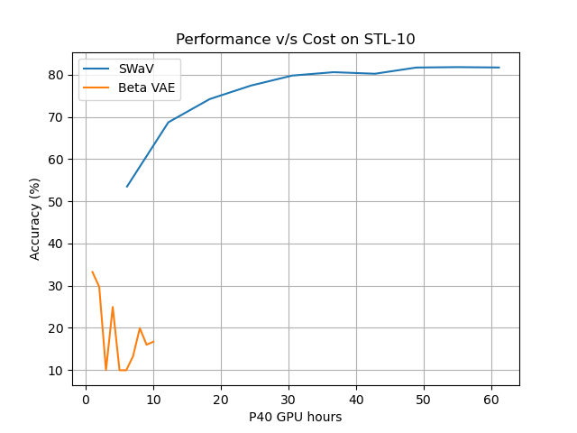
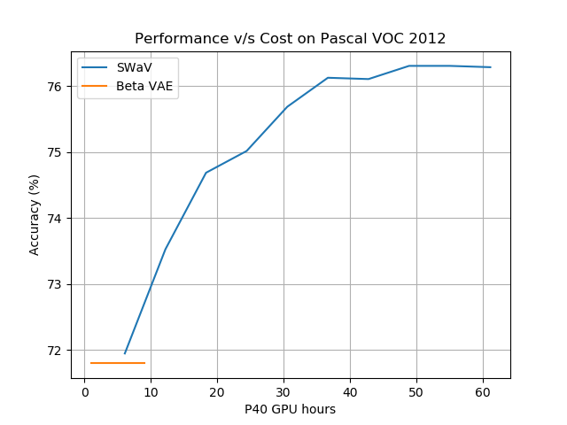

# DLS_Project
Course Project for Deep Learning Systems - Fall 2020

## Introduction

Recent Self-supervised Learning techniques (contrastive) outperform the previous ones 
(generative) in terms of asymptotic performance, but require a huge amount of compute. 
We investigate the performance v/s cost trade-off between current and previous methods.

## Experiments

We investigate two Self-supervised Learning techniques:

1. SWaV (Swapping Assignments between Views)
2. Beta VAE (Variational Auto Encoder)

We train two Resnet18 backbones on the STL-10 unlabeled dataset using these 
techniques, and then benchmark them on the STL-10 labeled dataset, and Pascal 
VOC 2012. The backbones are trained for 100 epochs and benchmarked every 10 epochs.
We plot the accuracy achieved on downstream tasks as a function of P40 GPU hours.

## Results






As you can see from the above graphs, SWaV outperforms Beta VAE 
when the amount of GPU hours is kept constant. But the cost of training
SWaV for 10 epochs rivals with the entire training cost of Beta VAE. We recommend
using SWaV to pre-train a backbone over Beta VAE unless one does not possess
sufficient GPU memory (96GB) or cannot afford to train for 10 hours. It is worth noting 
that the difference in performance is not much for the segmentation task.

## Run the code yourself

### SWaV

To train the backbone:

`python SWaV.py --gpus 4`

Evaluate SWaV on STL-10 labeled:

```
for ckpt in 9 19 29 39 49 59 69 79 89 99
do
  python finetune_stl.py --backbone_checkpoint $ckpt
done
```


Evaluate SWaV on Pascal VOC:

```
for ckpt in 9 19 29 39 49 59 69 79 89 99
do
  python finetune_pascal.py --backbone_checkpoint $ckpt
done
```

### beta-VAE

To train the backbone:

`python VAE.py --batch-size 64 --gpus 1`

Evaluate beta-VAE on STL-10 labeled:

```
for ckpt in 9 19 29 39 49 59 69 79 89 99
do
  !python FineTuning_VAE_STL10.py --backbone_checkpoint $ckpt --gpus 1
done
```

Evaluate beta-VAE on Pascal VOC:

```
for ckpt in 9 19 29 39 49 59 69 79 89 99
do
  python FineTuning_VAE_Pascal.py --backbone_checkpoint $ckpt
done
```

